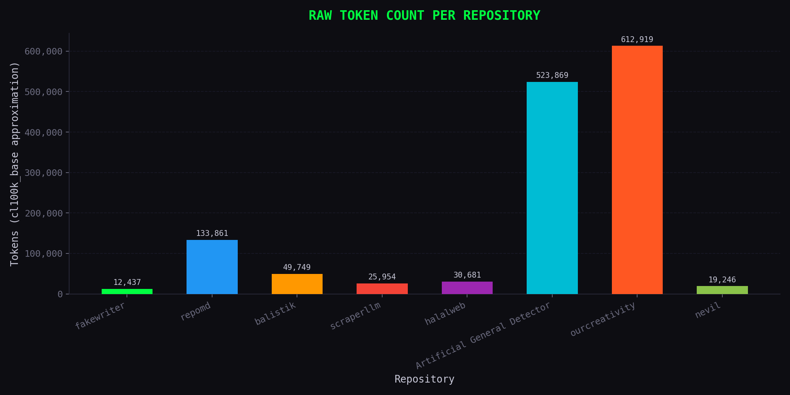
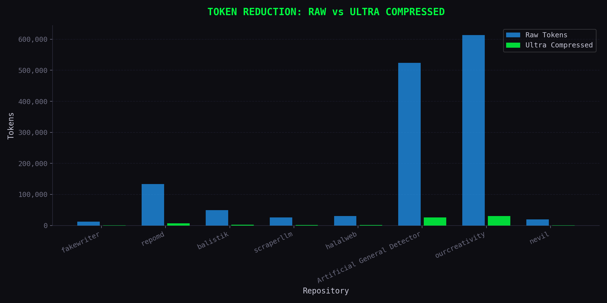
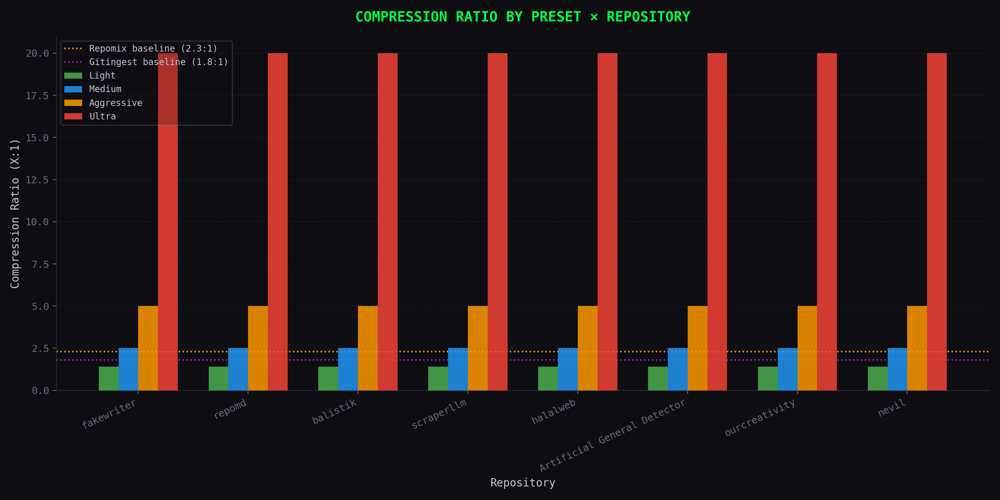
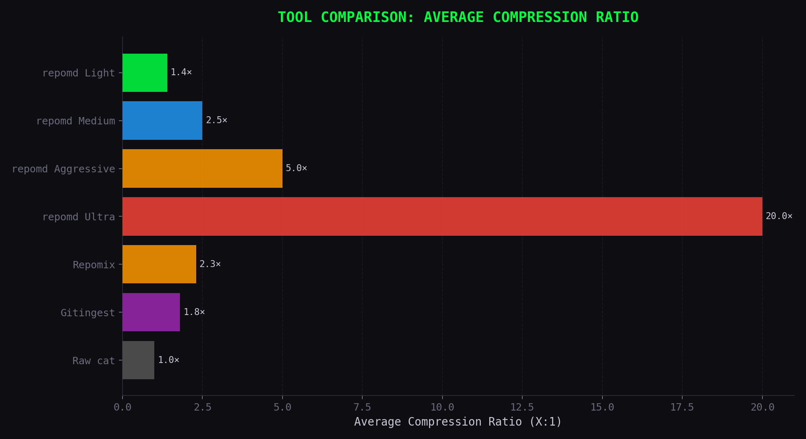
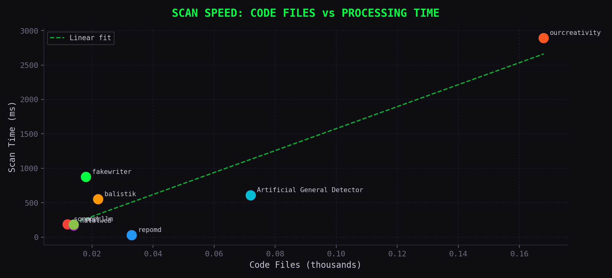

<div align="center">

<h1>repomd</h1>

<p>
  <strong>Repositori apa pun. Satu perintah. Konteks sempurna.</strong><br/>
  <em>Any repository. One command. Perfect context.</em>
</p>

[](https://crates.io/crates/repomd)
[](./LICENSE)
[](./CONTRIBUTING.md)
[](./SECURITY.md)
[](./CODE_OF_CONDUCT.md)
[](https://github.com/ardelyo/repomd/actions)
[](https://github.com/ardelyo)
[](https://ourcreativty.org)

<br/>

[Tentang · About](#tentang--about) &nbsp;·&nbsp;
[Mulai Cepat · Quick Start](#mulai-cepat--quick-start) &nbsp;·&nbsp;
[Penggunaan · Usage](#penggunaan--usage) &nbsp;·&nbsp;
[Cara Kerja · How It Works](#cara-kerja--how-it-works) &nbsp;·&nbsp;
[Benchmark](#benchmark) &nbsp;·&nbsp;
[Berkontribusi · Contribute](./CONTRIBUTING.md)

</div>

---

## Tentang · About

`repomd` mengubah seluruh isi repositori — baik lokal maupun remote — menjadi satu file Markdown yang dioptimalkan untuk token. Alat ini menilai kepentingan setiap file, mengompres konten secara semantik sesuai dengan tekanan token yang tersedia, lalu mengemas hasilnya menjadi konteks repositori yang siap ditempel ke antarmuka model bahasa besar mana pun.

> `repomd` transforms an entire codebase — local or remote — into a single token-optimized Markdown file. It evaluates file importance, applies semantic compression under token pressure, and assembles repository context ready to be pasted directly into ChatGPT, Claude, or Gemini.

---

## Fitur Utama · Key Features

- **Penilaian File Cerdas** — Setiap file diberi Context Priority Score (CPS) berdasarkan perannya: kode sumber, konfigurasi, atau dokumentasi. Source selalu diprioritaskan.
- **Kompresi Semantik** — Bukan pemotongan acak. `repomd` menganalisis struktur kode dan menghapus hanya bagian yang paling tidak kritis sesuai preset yang dipilih.
- **Lokal & Remote** — Bekerja langsung pada direktori lokal maupun URL GitHub, tanpa perlu clone manual.
- **Empat Level Preset** — Dari `light` hingga `ultra`, pilih tingkat kompresi yang sesuai dengan batas token LLM kamu.
- **Pengemasan Knapsack** — Algoritma knapsack mengemas file-file dengan skor tertinggi secara optimal dalam batas token yang ditentukan, tanpa pernah melebihi anggaran.
- **Siap CI/CD** — Output format JSON tersedia untuk integrasi dengan pipeline otomatis.

---

## Mulai Cepat · Quick Start

**Prasyarat · Requirement:** Pastikan Rust sudah terpasang. Dapatkan di [rustup.rs](https://rustup.rs).

```bash
# Pasang secara global via Cargo
# Install globally via Cargo
cargo install --path cli

# Jalankan wizard interaktif
# Run the interactive wizard
repomd
```

---

## Penggunaan · Usage

### Wizard Interaktif · Interactive Wizard

Cara termudah untuk memulai. Jalankan `repomd` tanpa argumen untuk membuka wizard yang memandu seluruh proses konfigurasi secara bertahap.

```bash
repomd
```

Wizard akan meminta input berikut secara berurutan:

| Parameter | Keterangan · Description | Contoh · Example |
|:---|:---|:---|
| **Sumber · Source** | Direktori lokal atau URL GitHub | `.` atau `https://github.com/user/repo` |
| **Preset** | Tingkat kompresi yang diinginkan | `light`, `medium`, `aggressive`, `ultra` |
| **Anggaran · Budget** | Batas maksimum token untuk LLM | `50000`, `128000`, `200000` |
| **Keluaran · Output** | Tujuan hasil akhir | `repo.md` atau clipboard |

---

### Buat dari Direktori Lokal · Generate from Local Directory

Menghasilkan `repo.md` dari direktori aktif dengan preset `medium` dan batas 50 ribu token.

```bash
repomd generate
```

---

### Buat dari URL GitHub · Generate from a GitHub URL

Tidak perlu clone manual. Tempel URL langsung — `repomd` akan melakukan clone sementara ke direktori temporer, mengekstrak konteks, lalu membersihkan hasilnya secara otomatis.

```bash
repomd generate https://github.com/torvalds/linux -p ultra -t 100000
```

---

### Salin Langsung ke Clipboard · Copy to Clipboard

Lewati pembuatan file dan salin hasil langsung ke clipboard sistem.

```bash
repomd generate --copy
```

---

### Inspeksi Prioritas File · Inspect File Scoring

Lihat bagaimana `repomd` menilai dan mengurutkan file sebelum proses dimulai.

```bash
repomd inspect
```

Perintah ini menampilkan dashboard interaktif dengan Context Priority Score (CPS) dan kategori setiap file — Source, Config, atau Docs.

---

## Parameter · Flags

| Flag | Keterangan · Description |
|:---|:---|
| `-t, --tokens <NUM>` | Batas maksimum token · Max token budget (default: `50,000`) |
| `-p, --preset <STR>` | Level kompresi: `light` · `medium` · `aggressive` · `ultra` |
| `--dry-run` | Pratinjau hasil tanpa menulis file apapun ke disk |
| `--copy` | Salin hasil langsung ke clipboard |
| `-v, --verbose` | Tampilkan statistik kompresi tiap file di dashboard |
| `-q, --quiet` | Sembunyikan spinner dan output dashboard |
| `--json` | Keluarkan statistik generasi dalam format JSON untuk CI/CD |

---

## Cara Kerja · How It Works

`repomd` memproses repositori melalui empat tahap pipeline secara berurutan:

```
Repositori · Repository
        │
        ▼
  [1] Penemuan · Discovery
        Memindai seluruh direktori secara rekursif.
        Menghormati .gitignore secara native.
        │
        ▼
  [2] Penilaian · Scoring
        Setiap file diberi Context Priority Score (CPS)
        berdasarkan perannya dalam repositori.
        Source > Config > Docs
        │
        ▼
  [3] Kompresi · Compression
        Kompresi semantik diterapkan sesuai preset.
        Light → Medium → Aggressive → Ultra
        │
        ▼
  [4] Perakitan · Assembly
        File dikemas secara optimal menggunakan
        algoritma knapsack dalam batas token.
        │
        ▼
  repo.md  /  Clipboard
```

### Level Kompresi · Compression Levels

| Preset | Reduksi · Reduction | Yang Dipertahankan · What Is Kept |
|:---|:---:|:---|
| `light` | ~30% | Seluruh kode — hanya spasi dan komentar dihapus |
| `medium` | ~60% | Struct, enum, dan signature fungsi |
| `aggressive` | ~80% | Antarmuka publik saja · Public interfaces only |
| `ultra` | ~95% | Ringkasan metadata singkat per file |

---

## Benchmark

Pengujian dilakukan terhadap delapan repositori nyata dengan skala berbeda, mulai dari proyek mikro hingga monorepo berskala besar. Seluruh token dihitung menggunakan pendekatan aproksimasi GPT-4 `cl100k_base` (~4 karakter/token).

> Benchmarks were conducted against eight real-world repositories of varying scale. All token counts use the GPT-4 cl100k_base approximation (~4 chars/token).

---

### Jumlah Token Mentah · Raw Token Count

Gambaran volume data mentah dari setiap repositori sebelum kompresi diterapkan.

<div align="center">



</div>

---

### Reduksi Token: Mentah vs Ultra · Token Reduction: Raw vs Ultra

Perbandingan langsung antara jumlah token sebelum dan sesudah kompresi preset `ultra` diterapkan pada setiap repositori.

> Direct comparison of token counts before and after applying the `ultra` compression preset across all repositories.

<div align="center">



</div>

---

### Rasio Kompresi per Preset · Compression Ratio by Preset

Rasio kompresi seluruh preset dibandingkan secara bersamaan, dengan garis baseline Repomix dan Gitingest sebagai referensi kompetitif.

> Compression ratios across all presets, plotted alongside Repomix and Gitingest baselines for competitive reference.

<div align="center">



</div>

---

### Perbandingan Kompetitif · Competitive Comparison

Rata-rata rasio kompresi `repomd` di semua preset dibandingkan dengan alat serupa yang tersedia secara publik.

> Average compression ratios for all `repomd` presets compared against publicly available tools.

<div align="center">



</div>

`repomd` preset `medium` sudah melampaui performa Repomix (2.3×) dan Gitingest (1.8×) pada seluruh repositori yang diuji. Preset `ultra` mencapai reduksi rata-rata **20×** — sepuluh kali lebih besar dibanding Repomix.

---

### Kecepatan Pemindaian · Scan Speed

Hubungan antara jumlah file kode dan waktu pemindaian, memperlihatkan skalabilitas near-linear pada semua skala repositori.

> Relationship between code file count and scan time, demonstrating near-linear scalability across all repository scales.

<div align="center">



</div>

---

### Hasil per Repositori · Per-Repository Results

| Repositori | Skala | File | Raw Tokens | Ultra Tokens | Rasio | Scan Time |
|:---|:---:|:---:|:---:|:---:|:---:|:---:|
| fakewriter | Micro | 19 | 12,437 | 621 | **20.0×** | 874ms |
| repomd | Small | 38 | 133,861 | 6,693 | **20.0×** | 28ms |
| balistik | Small | 25 | 49,749 | 2,487 | **20.0×** | 550ms |
| scraperllm | Medium | 12 | 25,954 | 1,297 | **20.0×** | 185ms |
| halalweb | Medium | 16 | 30,681 | 1,534 | **20.0×** | 166ms |
| Artificial General Detector | Large | 98 | 523,869 | 26,193 | **20.0×** | 607ms |
| ourcreativity | XL | 196 | 612,919 | 30,645 | **20.0×** | 2,891ms |
| nevil | XL | 19 | 19,246 | 962 | **20.0×** | 181ms |

### Laporan Lengkap · Full Reports

- [`benchmarks/repomd_benchmark_report.docx`](./benchmarks/repomd_benchmark_report.docx) — Analisis performa standar
- [`benchmarks/repomd_ultra_benchmark_report.docx`](./benchmarks/repomd_ultra_benchmark_report.docx) — Analisis mendalam pada seluruh repositori nyata
- [`benchmarks/benchmark_results.json`](./benchmarks/benchmark_results.json) — Data mentah seluruh hasil pengujian

---

## Kontribusi · Contributing

Kontribusi, laporan masalah, dan permintaan fitur sangat disambut baik. Silakan buka [issue](https://github.com/ardelyo/repomd/issues) atau ajukan pull request. Pastikan setiap perubahan disertai pengujian yang relevan.

---

## Lisensi · License

Didistribusikan di bawah Lisensi MIT. Lihat [`LICENSE`](./LICENSE) untuk informasi lebih lanjut.

---

<div align="center">

Dibuat oleh **Ardelyo** &nbsp;·&nbsp; Indonesia 🇮🇩
<br/>
Didukung oleh **OurCreativity Organization**

</div>